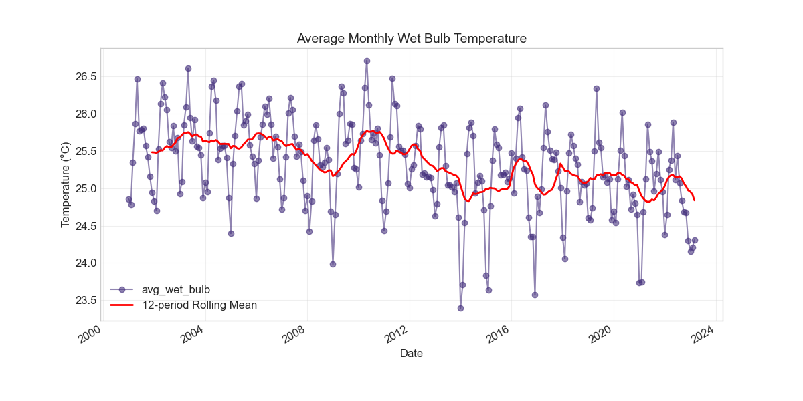
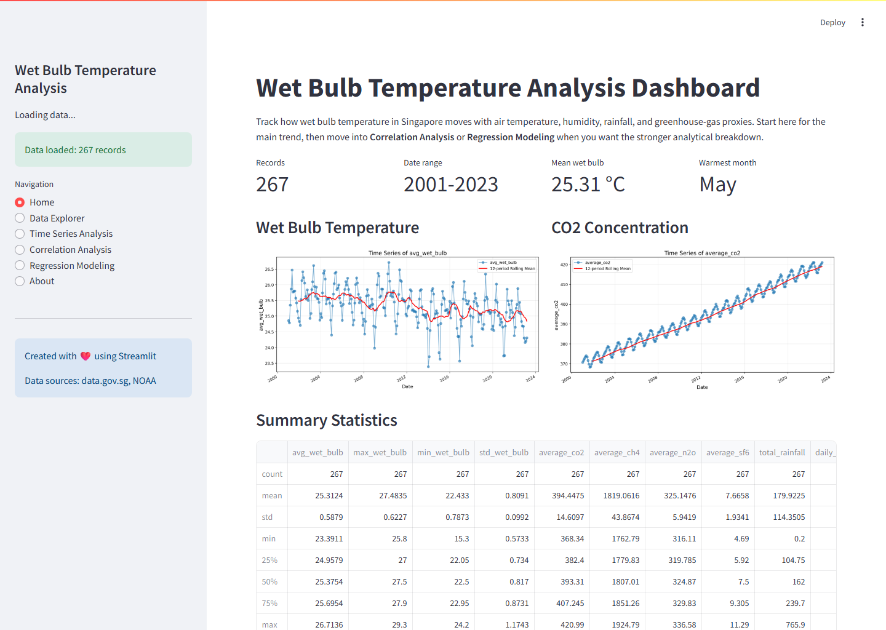

# Singapore Wet-Bulb Temperature Analysis Platform

A monthly climate-analysis app for Singapore wet-bulb temperature that combines raw CSV ingestion, preprocessing, exploratory charts, and linear regression in one repo.

It also supports repeatable analysis through a standalone script path and a notebook path.

<!-- README_SURFACE_START -->
  

[](https://adredes-weslee.github.io/data-science/climate/public-health/2023/05/15/predicting-heat-stress-with-wet-bulb-temperature.html) [](https://adredes-weslee-data-analysis-of-wet-bulb-te-dashboardapp-mwqkey.streamlit.app/)


## Interface Preview



## Quickstart

```bash
pip install -r requirements.txt
python scripts/preprocess_data.py
streamlit run dashboard/app.py
```

See [Setup and Run](#setup-and-run) for the full environment and verification path.

<!-- README_SURFACE_END -->

## Why This Repository Exists

- The repo frames wet-bulb temperature as a heat-stress and habitability problem, with the About page explaining the 35C threshold and Singapore relevance.
- The core question is how sunshine, rainfall, humidity, air temperature, and CO2/CH4/N2O/SF6 relate to wet-bulb temperature.

## Architecture at a Glance

- Entry points: `run_dashboard.py` shells into Streamlit, `dashboard/app.py` loads `data/processed/final_dataset.csv` or rebuilds it, `scripts/preprocess_data.py` writes the processed CSV and description, and `scripts/analyze.py` regenerates plots in `data/output`.
- Core modules are split by concern: `src/data_processing`, `src/features`, `src/models`, `src/visualization`, `src/utils`, and `src/app_pages`.
- The shipped processed CSV is monthly and currently starts with `month,avg_wet_bulb,..,mean_air_temp`.

## Repository Layout

- `dashboard/`
- `data/`
- `notebooks/`
- `scripts/`
- `src/`
- `.gitignore`
- `environment.yaml`
- `INSTRUCTIONS.md`
- `README.md`
- `requirements.txt`
- `run_dashboard.py`

## Setup and Run

1. Install with either `pip install -r requirements.txt` or `conda env create -f environment.yaml` plus `conda activate wet-bulb-temp`; both target Python 3.11 and the same core analysis stack.
2. Verify and preprocess with `python scripts/verify_environment.py` then `python scripts/preprocess_data.py`; the preprocessing script writes `data/processed/final_dataset.csv` and `dataset_description.md`.
3. Launch with `python run_dashboard.py` or `streamlit run dashboard/app.py`.
4. Run `python scripts/analyze.py` if you want the saved PNG outputs in `data/output`.

## Core Workflows

- Preprocess raw data: load wet-bulb, air-temp, climate, and greenhouse-gas CSVs, clean them, merge on `month`, and save the processed dataset plus summary text.
- Explore in the dashboard: Home, Data Explorer, Time Series, Correlation, Regression, and About are all routed from the sidebar.
- Model in the regression page: users can add temporal, interaction, lag, and rolling features, then train/evaluate a linear regression and download predictions.
- Regenerate the sample notebook with `scripts/create_sample_notebook.py`, which is intended to write `notebooks/sample_analysis.ipynb`.

## Known Limitations

- The repo is internally inconsistent on dataset scale and date range: some docs say 267 monthly observations from 7 sources, while `data/processed/dataset_description.md` says 497 records from Jan 1982 to May 2023 and the current CSV schema starts with `month,avg_wet_bulb,..,mean_air_temp`.
- `src/app_pages/home.py` still looks for legacy column names like `average_co2_ppm` and `mean_surface_airtemp`, so the home page does not line up with the current processed CSV names (`average_co2`, `mean_air_temp`).
- `scripts/create_sample_notebook.py` and `notebooks/sample_analysis.ipynb` call stale APIs (`add_trend`, `calculate_trends`, `create_interaction_features (., columns=.)`) that current modules do not expose.
- The partial-correlation branch imports `scipy.stats`, but `scipy` is not explicitly listed in `requirements.txt` or `environment.yaml`.
- I did not find a `tests/` directory or CI workflow in the repo tree, so claims about validation coverage would be unsupported.
- The README uses production-ready and live-demo language, but the repository itself does not include deployment or CI evidence to verify that claim.
